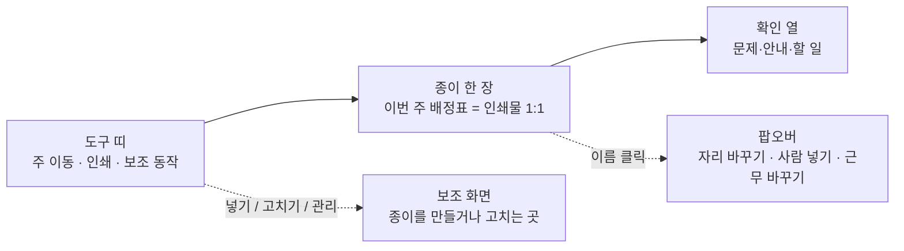

# 어싸인 배정표 UI 리디자인 브리프

2026-09-22 · 살아 있는 원본: https://claude.ai/code/artifact/d866b667-52cb-4865-9fbb-e68caa0f2185

결론부터: 이 프로그램은 **A4 한 장(이번 주 배정표)을 만드는 도구**이므로, 화면도 그 종이 한 장이 90%를 차지하는 문서형(document-first) 레이아웃이 맞다. 대시보드형·스프레드시트형은 기각한다. Claude Design에는 M8(2026-09-06, frontend 앱)과 같은 패키지 형식으로 화면 12장 + 컴포넌트 시트를 요청한다. 대상은 `standalone/assign.html` 하나이며, 이 파일은 아직 디자인 라운드를 거친 적이 없다.

## 1. 이 프로그램이 하는 일

병동 차지간호사가 **월간 근무표를 넣으면 이번 주 방 배정표(어싸인)가 나오고, 손봐서 A4로 인쇄**하는 단일 HTML 도구다. 인쇄물이 진짜 제품이고 화면은 그것을 만드는 편집기다.

| 화면 | 하는 일 | 빈도 | 스크린샷 |
| --- | --- | --- | --- |
| **배정표(주간)** | D/E/N × 요일 격자에 자리별 담당 간호사(+방). 이름 클릭=담당 바꾸기·근무 바꾸기·쉬는 사람 넣기, 방 칸 클릭=그날 방 수정, 인쇄, 엑셀 내보내기. 위에 확인 카드(경고·안내) | 주 1회 + 수시 | 04 · 06 · 11 |
| **근무표 넣기** | 엑셀 복사→붙이기(또는 xlsx 놓기) → 미리보기(이름·기간·새 이름·소속 분리·모르는 표기·연월 확인) → 저장 | 월 1회 | 03 |
| **근무표 고치기** | 이름×날짜 월간 격자. 셀 키보드 입력(D/E/N/O), 더블클릭 픽커, 아래 인원 합계 행, 병동/SU 구역, 오늘 열 | 수시 | 07 |
| **관리** | 병동·병실(14실, 병상수) · 방 구성(5·4·3·2인 프리셋, 요일 계획) · 요일별 필요 인원 · 근무 표기 · 배정표 양식(4벌+올리기) · 간호사 관리(순서=시니어리티, DC/EC/NC, SU 소속, 금지 방, 전출) · 배정 원칙 · 수동 수정 관리 · 데이터 보관 · 정보 | 처음 한 번 + 가끔 | 08 · 09 · 10 |
| **처음 설정 마법사** | 7단계 모달(병동→방 구성→필요 인원→근무표→표기→가능 근무→완료). 관리 패널을 그대로 끌어다 쓴다 | 처음 1회 | 02 |
| **첫 실행** | 환영 카드 + 시작 안내 카드(남은 준비 n개) + 도움말(실제 화면 투어 21개) | 처음 | 01 |
| **팝업 3종** | ① 어싸인 바꾸기 팝오버(자리 목록 · 쉬는 사람 넣기 · 근무 바꾸기) ② 방 고르기 팝오버(병상 단위 토글, 프리셋) ③ 선택 질문 모달(askModal — 날짜·근무·사람 고르기) | 수시 | 05 |
| **인쇄물** | 서식별로 다른 A4 — 101(방+이름 두 칸) · 122(이름+메모, 방은 세 열) · 102(방 칸 없음) · 82(방 칸 없음, SU 칸). 102·82는 엑셀로 내보내 엑셀에서 인쇄 | 주 1회 | — |

**사용자와 환경**

- 페르소나: 50대 차지간호사. 엑셀은 복사·붙이기 수준. 야간 근무 중에도 쓴다. 설명서를 읽지 않는다.
- 장소: 병동 PC 1대, **1920×1080**, Chrome/Edge, 인트라넷(외부 리소스 0 — 폰트까지 내장), `file://`로 열림, 같은 폴더의 데이터 파일 1개에 저장. 공유 기능 없음(병동당 PC 1대).
- 입력은 거의 전부 **다른 곳에서 복사해 오는 것**(파트장의 엑셀 번표). 키보드로 치는 것은 병상수·필요 인원 숫자 정도.
- 이 파일은 한 병동이 아니라 **14개 병동이 같이 쓴다**. 병동마다 양식이 다르고(방 칸 유무, 자리 이름, SU 칸), 이를 서식으로 흡수한다. 디자인은 서식을 모르는 채로 자리 수·이름이 바뀌어도 깨지지 않아야 한다.

## 2. 유사 서비스 조사

결론: 우리 도구의 직접 경쟁자는 SaaS가 아니라 **스테이션 벽의 화이트보드와 엑셀 양식**이다. 사용자는 이미 그 격자를 외우고 있으므로 화면이 그 격자를 그대로 따를 때 학습 비용이 0이 된다. 상용 도구에서 배울 것은 "문제를 고대비로 즉시 드러내는 방식"과 "간호사에게 이미 익숙한 근무 색 관습" 둘이다.

| 사례 | 무엇인가 | UI 특징 | 우리에게 시사점 |
| --- | --- | --- | --- |
| [간호사 배정 화이트보드](https://www.magneticconcepts.com/popular-designs/whiteboards-by-industry/hospital-and-medical-whiteboards/nurse-assignment-whiteboard) · [종이 배정표 템플릿](https://myltcapps.com/blog/nurse-assignment-sheet/) | 스테이션에 방법으로 쓰고 붙이는 것 | 마리글에 부서·날짜·근무, 행=간호사(또는 자리), 열=방/환자, 한눈에 마리 한 줄 | **우리 인쇄물의 원형.** 화면도 이 격자를 그대로 — 사용자가 배울 것이 없다 |
| [Cerner Clairvia Assignment Manager](https://palocacvprod.cernerworks.com/ClairviaWebExternal/help/Content/Understanding-the-Assign-Pts-View.htm) | 미국 간호 병원 어싸인 표준 도구 | 간호사 표 + 환자 표 두 패널, 드래그 없이 **선택식** 배정, 배정 상태 아이콘 3종(미배정/일부/완료), 과부하 빨강, 차지 아이콘, 입·퇴원 예정 요약 띠 | 헬스케어에서는 드래그보다 클릭-선택이 표준(정확성). 문제를 빨강으로 드러내고 요약 띠를 두는 방식은 우리 확인 카드와 같은 계열 — 유지 |
| [마이듀티](https://play.google.com/store/apps/details?id=kr.fourwheels.myduty&hl=en_US) · [널스노트](https://play.google.com/store/apps/details?id=lp.com.nursenote&hl=ko&gl=US) · [듀티메이트](https://dutymate.net/) · [쓰리오프](https://apps.apple.com/us/app/id1549490047?l=ko) | 한국 간호사가 쓰는 근무표 앱 | 월간 캘린더 + 근무 코드 색 칩(D 파랑, E 붉은 계, N 보라, OFF 회색) | 간호사에게 **이미 익숙한 색 관습**. 우리 SHIFTS 색이 이것을 따른다 — 바꾸지 말 것. 근무표 고치기 격자는 이 앱들과 같은 문법 |
| [NurseGrid](https://nursegrid.com/for-nurses/calendar/) · [시프트 스케줄러 시각화 정리](https://www.myshyft.com/blog/schedule-visualization-tools/) | 일반 교대근무 스케줄러 | 매트릭스 격자가 관리자 화면의 표준, 색은 "자주 봐야 하는 곳"에만, 다크 모드 요구 많음 | 격자 = 관리자 화면. 색은 근무 코드와 상태에만. 다크 모드는 야간 근무자에게 실제 수요 |
| [간호 스케줄링 디자인 사례연구 (C. Luc)](https://www.christineluc.com/visual-design-for-nurse-scheduling) | 간호 관리자용 스케줄러 디자인 과정 | 고압·주의 분산 환경 → "문제는 고대비로 즉시 보이게", 완전 플랫은 피하고 기능 우선순위를 시각으로, 구형 장비·연령대 감안한 큰 타이포 | 우리 원칙과 일치. 계속 |
| [간호사-환자 배정 8단계 (American Nurse Today)](https://www.myamericannurse.com/wp-content/uploads/2018/09/ant9-Assignments-822.pdf) | 차지가 배정할 때 고려하는 것 | 연속성(continuity) · 신규 오리엔테이션 · 공정성 · 업무량 균등 · 병동 지리(방 근접) | 연속성·방 근접은 이미 코어 원칙. 화면은 "어제와 같은 방인가"를 한눈에 보여 줘야 한다(지금은 바뀐 것만 색으로) |
| 문서형 편집기(엑셀 인쇄 미리보기, Docs 류) | "보이는 것이 인쇄된다" | 문서 한 장이 화면 중앙, 도구는 가장자리 | 우리 v3 원칙(2026-07-27 "문서형"). 더 밀어붙일 것 — 화면 배정표와 인쇄물의 자리 순서·이름이 1:1 |

조사에서 **쓰지 않기로 한 것**: 드래그 앤 드롭 배정(50대 마우스 조작 실수·발견 어려움 — Clairvia도 안 쓴다), 환자 단위 중증도(우리는 방 단위고 환자 정보가 없다), 간트/히트맵(일주일 3듀티에는 과하다).

## 3. 결론 — 레이아웃과 디자인 방식

**"종이 한 장 + 도구 띠 + 확인 열"** 이다. 화면의 주인공은 이번 주 배정표 한 장이고, 그 밖의 모든 것은 그 종이를 고치거나 인쇄하는 도구다.

읽기: 사용자의 시선은 종이(B)에 머무르고, 문제가 있을 때만 확인 열(C)이 불러낸다. 보조 화면(E)은 들어갔다 나오는 곳이고 종이와 경쟁하지 않는다.

**예시 배치 (1920×1080)**

| 영역 | 크기 | 무엇이 있나 |
| --- | --- | --- |
| 마리 띠 | 전폭 × 56px | 왼쪽: 이름 · 병동 칩(82병동 · 병실 14 · 간호사 14). 가운데: 배정표 / 관리 전환. 오른쪽: 저장 상태 **한 개**(지금은 배지 둘), 테마 |
| 도구 띠 | 종이 위 × 64px | ◀ **9월 13일 주** ▶ 오늘 │ 주 버튼 **인쇄** 1개 · 엑셀 내보내기 · ⋯ 더보기(넣기 · 고치기 · 쉬는 사람 넣기) — 지금은 단추 5개가 나란히 |
| 종이 | 중앙 약 1480px, 남는 세로 전부 | 인쇄물과 같은 격자. 자리 순서·이름은 서식이 정한다. 이름 20px, 방 15px. 오늘 열 강조 |
| 확인 열 | 오른쪽 360px, **종이를 밀지 않음** | 문제(붉은 줄) → 안내(노란 줄) → 준비 항목 순. 줄별 [고치기] 단추. 문제 0개면 접힌다. 1920에서 지금 오른쪽 440px이 빈 공간이다(스크린샷 06) — 그 자리 |

**기각한 대안**

| 대안 | 왜 기각 |
| --- | --- |
| 스프레드시트형(엑셀 흉내) | 익숙하지만 "다음에 무엇을 해야 하는지"가 안 보이고, 인쇄물과 화면이 어그남. 엑셀을 닮을 거면 엑셀을 쓰는 게 낫다 |
| 대시보드형(카드 여러 개) | 정보 과다. M8 원칙 "표 위에 카드 없음"과 충돌. 지금 넣기 화면이 이 모양(카드 5개 세로)인데 저장 단추가 스크롤 밖이다(스크린샷 03) |
| 캘린더형 | 배정표는 캘린더가 아니라 듀티×자리×요일 격자. 근무표 고치기에만 맞다 |

**시각 방식**: 종이(배경 `--paper`) 위에 흰 카드(`--card`) — 이미 가진 언어를 유지. 액센트는 잉크 검정 하나(`#0F1115`), 색은 근무 코드와 상태(문제/안내/정상)에만. 원칙은 M8을 그대로 계승해 두 앱이 한 집안처럼 보이게 한다(6절).

## 4. 화면별 설계 지침

각 화면이 답해야 하는 질문 하나씩을 정하고, 그 질문에 없는 것은 묻는다.

| 화면 | 답해야 하는 질문 | 지침 |
| --- | --- | --- |
| 배정표 | "이번 주 누가 어디를 보나, 고칠 게 있나" | 종이가 첫 화면. 주 버튼은 인쇄 하나. 문제는 격자 안 칸에도 표시(빨간 점·밑줄)하고 확인 열에 같은 문제가 같은 색으로 — 칸과 목록이 서로 가리킨다. 빈 주(근무표 없음)는 격자 자리에 "9월 근무표를 넣으면 채워집니다 [넣기]" 한 줄만. 서식별 차이(방 칸 유무, SU 줄, 중간번 위치)는 격자 구조로만 다르고 크로무는 같다 |
| 어싸인 바꾸기 팝오버 | "이 사람을 누구와 바꿀까 / 이 근무에 누구를 넣을까 / 이 사람 근무를 바꿀까" | 세 일을 세 단(자리 · 사람 · 근무)으로 나누고 단 이름을 진하게. 첫 단(자리 바꾸기)이 90% 사용 — 가장 크게. 자리 버튼에 "이 사람과 맞바꿈" 이 읽히게(지금은 이름 + 방 번호만). 방 칸 없는 서식에서는 방 번호 열이 사라진 것을 가정 |
| 쉬는 사람 넣기 모달 | "오늘 D에 누구를 불러올까" | 후보 한 줄 = 이름 · 지금 근무 칩 · 경고(가능 근무 아님 / 전날 야간). 경고 있는 사람은 아래로, 숨기지 않고 |
| 근무표 넣기 | "제대로 읽혔나, 저장해도 되나" | 지금 카드 5개가 세로(안내 · 통계 · 모르는 표기 · 연월 · 소속), 저장이 스크롤 밖. 미리보기 표를 중앙에, **결정해야 할 것만** 오른쪽 열에 쌓고(모르는 표기 2개 · 연월 확인 · SU 5명), 저장 단추는 항상 보이는 고정 바. 붙이기 전엔 "엑셀에서 이렇게 복사" 안내 한 장만 |
| 근무표 고치기 | "이 달 누가 언제 뭐를 하나, 인원이 맞나" | 한국 근무표 앱 문법 그대로(격자 + 색 칩). 오늘 열 강조, 구역 마리줄(병동 / SU), 인원 합계는 병동과 SU 따로. 셀 더블클릭 픽커는 근무 칩을 색 그대로 버튼으로 |
| 관리 | "우리 병동 설정이 맞나" | 왼쪽 목차 + 본문 유지. 표 3종(capsTable · roomTable · planTable)을 **표 컴포넌트 1종**으로. 패널 설명문은 한 줄 + "자세히" 접기. 병동↔서식이 한 쌍임을 하나의 카드로(지금은 두 패널에 따로) |
| 마법사 | "다음에 뭐 하면 되나" | 단계마다 질문 하나 + 설명 한 줄 + 패널. 관리 패널을 그대로 끌어다 쓰되 **마법사 안에서는 설명문·보조 버튼을 숨기는 컴팩트 변형**. 진행 막대는 지금 점 7개 → 단계 이름 7개 |
| 첫 실행 | "어디부터 시작하나" | 지금 3중(환영 카드 → 시작 안내 카드 → 마법사). **환영 카드를 마법사 0단계로 합치고**, 시작 안내는 확인 열의 "준비" 묶음으로 흡수 |
| 인쇄 | — | **Claude Design 범위 밖.** 인쇄물은 병동이 준 xlsx 양식이 정한다. 단, 인쇄 전 미리보기가 화면 종이와 같아 보이도록 화면 종이가 인쇄물을 따른다 |

## 5. 지금 화면의 문제

이 세션(9/20–22)에서 실제로 걸린 것만 적었다. 번호는 참고 스크린샷(01–11, 1920×1080 라이트 + 11번 다크).

| # | 문제 | 어떻게 보이나 | 스크린샷 |
| --- | --- | --- | --- |
| 1 | 주 동작이 안 보인다 | 도구 띠에 단추 5개가 같은 무게로 나란히(쉬는 사람 넣기 · 근무표 고치기 · 새 근무표 넣기 · 인쇄 · 엑셀). 주 색이 엑셀에 가 있는데 주 1회 쓰는 것은 인쇄/엑셀 둘 중 하나 | 04 · 06 |
| 2 | 가로 공간 낭비 | 1920에서 종이가 1470px에서 멈추고 오른콽 440px이 빈다. 그 자리가 확인 열의 자리 | 06 |
| 3 | 확인 카드가 종이를 밀어낸다 | 카드가 격자 위에 쌓이고 길어지면 격자가 아래로(한때 274px 넘쳐 상단 띠가 화면 밖). 지금은 접기로 막았지만 구조적 해결이 아니다 | 04 |
| 4 | 표가 세 모양 | 간호사 관리 · 병실 목록 · 요일 계획이 각각 다른 표 스타일·열 폭·단추 크기. 마법사 안에서는 그 표가 좁아지며 입력칸 옆 글자가 아래로 떨어진 적이 있다(고침) | 02 · 08 · 09 |
| 5 | 설명문이 길다 | 관리 패널 마리글 설명이 2–3줄, 미리보기 첨부 안내도 길다. 50대 사용자는 읽지 않고 단추를 찾는다 | 08 · 10 |
| 6 | 팝오버 안 위계 | 어싸인 바꾸기 팝오버에 자리 바꾸기 · 쉬는 사람 넣기 · 근무 바꾸기 17개 칩이 같은 크기로 세로. 자주 쓰는 것(자리 바꾸기)과 드문 것(근무 코드 17개)이 같은 무게 | 05 |
| 7 | 넣기 화면이 세로 카드 5개 | 안내 → 통계 → 순서 체크 → 모르는 표기 → 연월 → 소속 → 표 → 저장. 저장 단추가 스크롤 밖 | 03 |
| 8 | 마리 띠 상태 배지 나열 | 병동 칩 옆에 "저장 파일 없음"과 "파일 미연결" 배지가 둘 다 붉게 — 같은 말이고 위계가 없다 | 08 |
| 9 | 소속(SU) 표기가 세 가지 | 표에서는 마리줄, 간호사 관리에서는 칩, 미리보기 통계에서는 글자. 하나의 시각 언어가 필요 | 03 · 07 · 08 |
| 10 | 다크에서 근무 칩 대비 미검증 | 다크 토큰은 있지만 근무 색 17종의 어둠 배경 대비가 설계된 것이 아니다. 야간 근무자가 쓴다 | 11 |

이 중 4의 줄바꿈과 9의 데이터 측은 이번 세션에서 고쳐 놓았다. 나무 것은 디자인 판단이 필요해 여기 남긴다.

## 6. 디자인 원칙과 토큰

M8(frontend 앱) 원칙을 그대로 계승하고, 이 파일에서만 필요한 것 세 개를 덧붙인다.

**계승하는 원칙(M8)**: 본문 18px · 클릭 타겟 48px · 연한 회색 글자 금지(`--ink-3` 이하를 본문에 쓰지 않기) · 아이콘만 버튼 금지 · 화면마다 주 버튼 1개 · 표 위에 카드 없음 · 모든 버튼에 툴팁(title) · 영어 라벨·개발 용어 0.

**이 파일밖의 원칙**

1. **종이가 인쇄물을 따른다.** 자리 순서·자리 이름·중간번 위치·SU 칸은 서식(병동 xlsx)이 정하고 화면은 그것을 그린다. 디자인은 격자의 **모양 규칙**(칸 높이, 색, 구역 배경, 마리줄)을 정하고 칸의 개수·이름은 가정하지 않는다.
2. **색은 드문 것에만.** 근무 코드 칩(간호사 관습 색), 문제(붉은), 안내(노란), 오늘 열. 나머지는 잉크와 종이.
3. **모든 동작은 보이는 단추로.** 숨은 제스처·우클릭·키보드만으로 되는 일은 없다. 되돌리기는 언제나(토스트 + Ctrl+Z, 이미 있음).

**유지할 현재 토큰** (`standalone/assign.html` `:root`, 이름은 유지하고 값만 다듬을 것 — 이름이 바뀌면 6,500줄을 다 고쳐야 한다. 전체 목록은 `현재앱/현재-토큰.css`)

| 묶음 | 토큰 | 값(라이트) |
| --- | --- | --- |
| 바탕 | `--paper` `--paper-2` `--paper-3` `--card` `--card-warm` | #F4F5F7 · #EDEFF3 · #E4E7EC · #FFFFFF · #F8F9FB |
| 글자 | `--ink` `--ink-2` `--ink-3` `--ink-4` | #0F1115 · #4A5160 · #8A93A1 · #B8BFC9 |
| 선 | `--rule` `--rule-2` `--rule-soft` `--rule-faint` | #EBEDF0 · #DCE0E6 · #F2F3F5 · #F6F7F9 |
| 강조 | `--accent` `--accent-hover` `--on-accent` | #0F1115 · #23262D · #fff |
| 상태 | `--ok` `--warn` `--err` (+ `-bg`) | #1F8A5B · #B7791F · #C7384A |
| 근무 | D `--d-bg`/`--down-deep` · E `--err-bg`/`--err` · N `--n-bg`/`--n-ink` · 중 `--warn-bg`/`--warn` · OF `--rule-soft`/`--ink-3` · V·공 `--ok-bg`/`--ok` · 생 `--sh-saeng-*` · 특 `--sh-teuk-*` · 법 `--sh-beop-*` · P1 `--sh-p1-*` | 다크 값은 `:root[data-theme=dark]`에 있음 |
| 글꼴 | Pretendard Variable(내장, base64) | 기본 15px → **18px로 올릴 것** |
| 모양 | 버튼 12px · 카드 14px · 세그 버튼 8px | 그림자 `--shadow-card` 하나 |

**다크 모드**: 자동/라이트/다크 3단 전환이 있다. 야간 근무자가 쓰므로 다크는 선택이 아니라 필수. 근무 코드 17종의 어둠 배경 대비(4.5:1)를 모두 검증해 받을 것 — 지금은 검증된 것이 아니다.

## 7. Claude Design에 요청할 산출물

M8과 같은 패키지 형식을 요청한다 — 그 형식이 구현자가 값을 어림잡을 여지를 없애 준 것이 입증됐다(검사기 0 불일치로 완료).

**화면 × 상태 (1920×1080, 라이트 기본 + 다크 3장)**

| # | 화면 | 상태 |
| --- | --- | --- |
| 1 | 배정표(주간) | 기본(101 서식, 방 칸) · 문제 3개 있는 주 · 빈 주(근무표 없음) · 82 서식(방 칸 없음, SU 줄, 중간번이 D 안) · **다크** |
| 2 | 어싸인 바꾸기 팝오버 | 이름 클릭 직후 · 방 칸 없는 서식 변형 |
| 3 | 쉬는 사람 넣기 모달 | 후보 4명(경고 1명 포함) |
| 4 | 방 고르기 팝오버 | 병상 단위 토글 + 프리셋 줄 |
| 5 | 근무표 넣기 | 붙이기 전(안내 한 장) · 붙인 뒤(미리보기 + 결정 3개: 모르는 표기 2 · 연월 · SU 5명) |
| 6 | 근무표 고치기 | 14명 × 30일, 병동/SU 구역, 인원 합계 행(병동·SU 따로), 오늘 열 · **다크** |
| 7 | 관리 — 간호사 관리 | 14명, SU 칩, 금지 방 칩, 전출 1명 |
| 8 | 관리 — 병동·병실 + 배정표 양식 | 한 카드로(병동↔서식 한 쌍) · 양식 없는 병동(61) 상태 |
| 9 | 관리 — 방 구성 | 5인 프리셋 + 요일 계획표 |
| 10 | 마법사 | 1단계(병동) · 4단계(근무표) · 6단계(가능 근무) · 7단계(완료) |
| 11 | 첫 실행 | 환영 = 마법사 0단계 · 준비 묶음이 확인 열에 |
| 12 | 컴포넌트 시트 | 버튼 위계 3단 · 근무 칩 17종(라이트/다크) · 표 1종 · 구역 마리줄 · 상태 줄(문제/안내/정상) · 팝오버 · 모달 · 토스트(되돌리기) · 배지 · 마리 띠 칩 · **다크** |

**패키지 구성**

- `design/*.dc.html` — 화면별 디자인 원본, 모든 스타일 인라인, 상태 전환(Tweaks) 가능
- `reference/*.png` — 1920×1080 원본, 화면×상태별 1장
- `css/tokens.css` — **기존 `:root` 변수 이름 유지**, 값만(라이트/다크). 새 토큰은 기존 이름으로의 매핑 표 첨부
- `css/components.css` — 버튼·칩·표·카드·팝오버·모달·토스트 클래스. 외부 의존 0, 폰트는 내장 Pretendard만
- `copy.json` — 바뀐 문구와 툴팁 전문. 기존 문구를 이름 바꾸는 것이므로 "예전 → 새" 매핑
- `check/spec.json` — 검사 항목(높이·글자 크기·굵기·색·문구·툴팁 유무·주 버튼 1개·연한 글자 0). 이번엔 **줄바꿈 검사**도(이 세션에서 만든 인라인 접힘 검사를 넣는다)
- `doc.dc.html` — 변경 근거 · 제거 제안 · 구현 순서

**제약 (바꿀 수 없는 것)**

1. 단일 HTML 파일, 외부 리소스 0(CDN·웹폰트·아이콘 라이브러리 금지). 아이콘이 필요하면 인라인 SVG ≤ 12개.
2. 기능 삭제 0. 핸들러 이름(`onclick="..."`) 유지 — 검사는 `scripts/handler_inventory.py`.
3. 인쇄물은 건드리지 않는다. 화면 종이의 격자는 서식이 정한 자리를 그린다(칸 수·이름 가정 금지).
4. 한국어만. 영어 라벨 0(D/E/N 근무 코드는 예외 — 병동 표기 그대로).
5. `:root` 토큰 이름 유지.
6. 1920×1080이 기준이지만 **1000px 폭에서도 접히지 않을 것**(개발자 노트북에서 검수한다).

**완료 기준(DoD)**: `check_redesign.mjs` 실패 0 · `handler_inventory.py` REMOVED 0 · reference PNG와 나란히 보아 차이 없음 · 줄바꿈 검사 0(1000·1280·1920) · 기존 회귀 검사 전부 통과(로직 108 · E2E 25 · pytest 167).

## 8. Claude Design에 붙일 프롬프트

`02-프롬프트.txt` 에 같은 내용이 있다. 그대로 붙이고, 참고 스크린샷 11장과 `assign.html`을 함께 올린다.

## 9. 참고 자료와 출처

직접 열어 본 페이지만 적었다. 마이듀티·널스노트·쓰리오프는 스토어 설명·스크린샷 기준이다.

- [Clairvia Web — Understanding the Assign Patients View](https://palocacvprod.cernerworks.com/ClairviaWebExternal/help/Content/Understanding-the-Assign-Pts-View.htm) · [Assignment Manager Overview](https://palocacvprod.cernerworks.com/ClairviaWebExternal/help/Content/Assignment-Manager-Overview.htm) · [Children's Minnesota — Clairvia Charge Nurse Guide](https://www.childrensmn.org/departments/training/emr/clairvia-go-live-charge-nurse-handbook.pdf)
- [Christine Luc — Visual Design for Nurse Scheduling](https://www.christineluc.com/visual-design-for-nurse-scheduling)
- [American Nurse Today — 8 steps for making effective nurse-patient assignments (2018)](https://www.myamericannurse.com/wp-content/uploads/2018/09/ant9-Assignments-822.pdf)
- [Magnetic Concepts — Nurse Assignment Whiteboard](https://www.magneticconcepts.com/popular-designs/whiteboards-by-industry/hospital-and-medical-whiteboards/nurse-assignment-whiteboard) · [MyLTC Apps — Nurse Assignment Sheet Templates](https://myltcapps.com/blog/nurse-assignment-sheet/)
- [myshyft — Schedule Visualization Tools](https://www.myshyft.com/blog/schedule-visualization-tools/) · [NurseGrid — Calendar](https://nursegrid.com/for-nurses/calendar/)
- [마이듀티](https://play.google.com/store/apps/details?id=kr.fourwheels.myduty&hl=en_US) · [널스노트](https://play.google.com/store/apps/details?id=lp.com.nursenote&hl=ko&gl=US) · [듀티메이트](https://dutymate.net/) · [쓰리오프](https://apps.apple.com/us/app/id1549490047?l=ko)
- 리포 안: `docs/milestones.md` M8(이전 핸드오프 기록) · `design/handoff/README.md`(패키지 형식과 DoD) · `CLAUDE.md` 서식 4벌 절 · 참고 스크린샷 11장(2026-09-22, 1920×1080, 가명 데이터)
